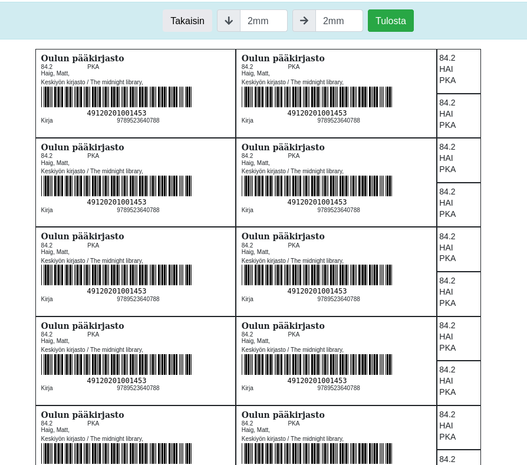
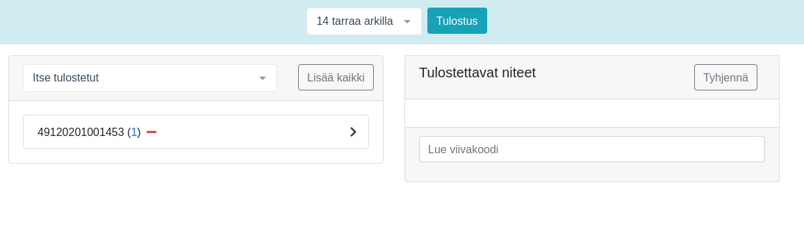
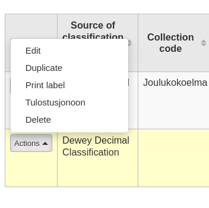

# Koha-Suomi Visual Label tool plugin

Create labels with visual tool

# Installing

Koha's Plugin System allows for you to add additional tools and reports to Koha that are specific to your library. Plugins are installed by uploading KPZ ( Koha Plugin Zip ) packages. A KPZ file is just a zip file containing the perl files, template files, and any other files necessary to make the plugin work.

The plugin system needs to be turned on by a system administrator.

To set up the Koha plugin system you must first make some changes to your install.

    Change <enable_plugins>0<enable_plugins> to <enable_plugins>1</enable_plugins> in your koha-conf.xml file
    Confirm that the path to <pluginsdir> exists, is correct, and is writable by the web server
    Remember to allow access to plugin directory from Apache

    <Directory <pluginsdir>>
        Options Indexes FollowSymLinks
        AllowOverride None
        Require all granted
    </Directory>

    Restart your webserver

Once set up is complete you will need to alter your UseKohaPlugins system preference. On the Tools page you will see the Tools Plugins and on the Reports page you will see the Reports Plugins.

# Downloading

From the release page you can download the latest \*.kpz file

# Configure

Jquery statements to add items to printing queue are now part of this plugin and no other configuration is needed.

# How create and modify labels

1. Create and modify labels in configuration.

2. Define labels name and dimensions

3. Define label's fields on fields tab.
   You can choose from the list or create a custom field where you can add fields with subfields.
   The custom fields can be combined with AND/OR (&&/||)

   Predefined fields that are not in the tables:

   1. items.barcode => Readable barcode
   2. items.barcodevalue => Only numbers
   3. items.branchname => Homebranch's description in branches table
   4. items.location => LOC description from authorised values
   5. items.signumYKL => YKL code from itemcallnumber
   6. items.signumLoc => Location from itemcallnumber
   7. items.signumHeading => Main heading from itemcallnumber
   8. marc.title => 245$a && 245$b && 245$p && 245$n || 111$a || 130$a
   9. marc.author => (942$i || 100$a) && (100$c || 110$a || 111$a)
   10. marc.unititle => 130$a && 130$l
   11. marc.description => 300$a && 300$e && 347$b
   12. marc.publication => 260$c || 264$c
   13. marc.volume => 262$a || 049$a

4. Define signum and fields

5. The fields will appear to label preview and when the postion is changed the field will move on the preview.

6. Print a test label sheet. The configurations have to be saved to get the newest changes. You can modify top and left margins of the print from topbar, those apply only in the printing view.
   For the test sheet the plugin fetches the first item from the database and fills fields.

# How to use

1. Run the tool.
2. Choose from created labels.
3. Choose items from the lists available and click them to be printed or read barcodes to the input field.
   
   If intranetusejs setting is in place (see above), you can add items to your own list from item's actions.
   
4. Today acquired items are fetched with dateaccessioned value.
5. The plugin keeps a list of printed labels so you can return to them and choose to be printed again.
