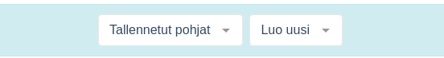
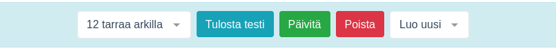
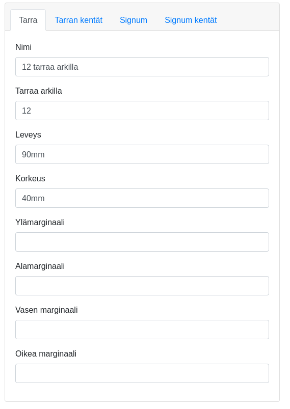
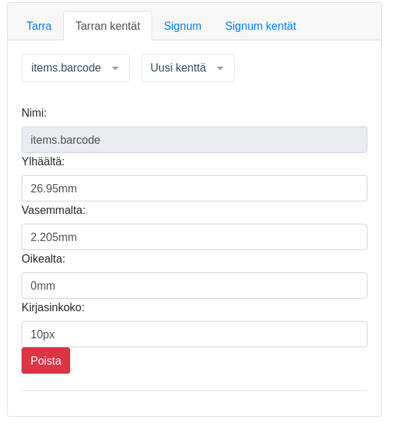
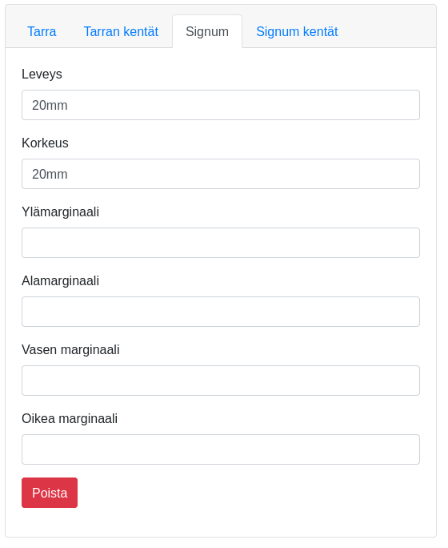
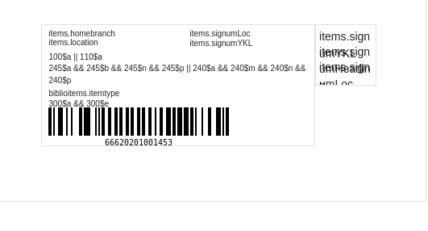
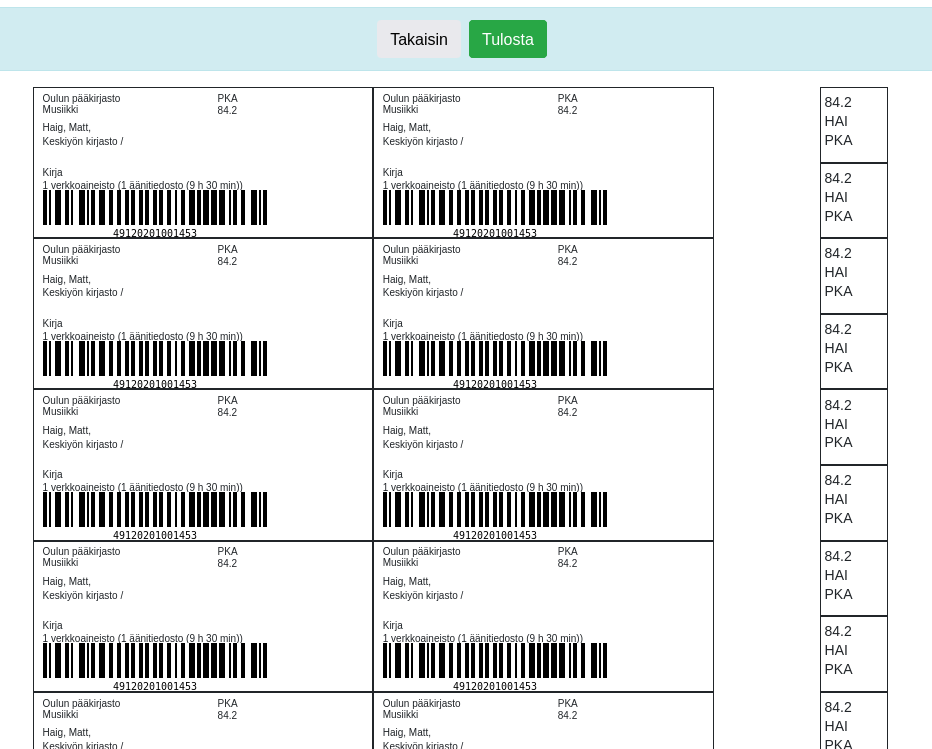

# Koha-Suomi Visual Label tool plugin

Create labels with visual tool

# Installing

Koha's Plugin System allows for you to add additional tools and reports to Koha that are specific to your library. Plugins are installed by uploading KPZ ( Koha Plugin Zip ) packages. A KPZ file is just a zip file containing the perl files, template files, and any other files necessary to make the plugin work.

The plugin system needs to be turned on by a system administrator.

To set up the Koha plugin system you must first make some changes to your install.

    Change <enable_plugins>0<enable_plugins> to <enable_plugins>1</enable_plugins> in your koha-conf.xml file
    Confirm that the path to <pluginsdir> exists, is correct, and is writable by the web server
    Remember to allow access to plugin directory from Apache

    <Directory <pluginsdir>>
        Options Indexes FollowSymLinks
        AllowOverride None
        Require all granted
    </Directory>

    Restart your webserver

Once set up is complete you will need to alter your UseKohaPlugins system preference. On the Tools page you will see the Tools Plugins and on the Reports page you will see the Reports Plugins.

# Downloading

From the release page you can download the latest \*.kpz file

# Configure

Add items to printing queue with intranetuserjs

    $(document).ready(function() {
        $(".print_label").after('<li><a href="#" onclick="setPrintQueue($(this))">Tulostusjonoon</a></li>');
    });

    function setPrintQueue(element) {
    let searchParams = new URLSearchParams(element.parent().parent().find(".print_label a").attr("href"));
    $.ajax({
    url: "/api/v1/contrib/kohasuomi/labels/print/queue",
    type: "POST",
    dataType: "json",
    contentType: "application/json; charset=utf-8",
    data: JSON.stringify({ itemnumber: searchParams.get('number_list'), printed: 0 }),
    success: function (result) {
        alert("Nide lisätty jonoon!");
        },
        error: function (err) {
            alert("Lisäys epäonnistui!");
        }
    });
    }

# How create and modify labels

1. Create and modify labels in configuration.

2. Define labels name and dimensions

3. Define label's fields on fields tab.

4. Define signum and fields

5. The fields will appear to label preview and when the postion is changed the field will move on the preview.

6. Print a test label sheet. The configurations have to be saved to get the newest changes.

